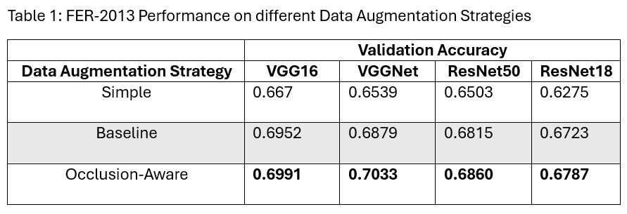
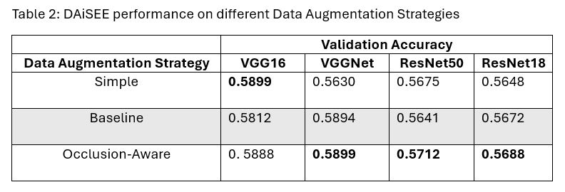

# <div align="center">Occlusion-aware Engagement Detection Framework</div>

An occlusion-aware framework which implements occlusion-simulating data augmentation methods and occlusion reconstruction to improve facial expression and engagement detection compared to non-occlusion-aware models.

## Table of Content

- [Installation](#installation)
- [Datasets](#datasets)
- [Usage](#usage)
- [Results](#results)
- [Contacts](#contacts)
- [License](#license)

## <a id="installation">Installation</a>

1. Create a conda environment.

```
conda create --name occlusion_aware
conda activate occlusion_aware
```

2. Install Python v3.10.11.

```
conda install python=3.10.11
```

3. Clone the repository.

```
git clone https://github.com/teddyld/occlusion-aware-engagement-detection.git
```

4. Install the required libraries.

```
pip install -r requirements.txt
```

5. Setup [CompreFace](https://github.com/exadel-inc/CompreFace) docker and modify `./utils/detect.py` environment variable

## <a id="datasets">Datasets</a>

The FER-2013 dataset can be accessed on [Kaggle](https://www.kaggle.com/datasets/msambare/fer2013)

The DAiSEE dataset can be accessed on the following [website](https://people.iith.ac.in/vineethnb/resources/daisee/index.html)

## <a id="usage">Usage</a>

Transforms are available in `./utils/dropouts` and `./utils/transforms.py`.

Data pre-processing is executed by running the cells in `daisee_data.ipynb` and `fer_data.ipynb`.

The notebook `model_run.ipynb` applies the transforms and runs training.

To run the occlusion recovery model (Masked Autoencoder) check out my other repo [mae-torch](https://github.com/teddyld/mae-torch)

Download model weights in [GitHub releases](https://github.com/teddyld/occlusion-aware-engagement-detection/releases/tag/v1.0).

## <a id="results">Results</a>

### Data Augmentation

- FER-2013



- DAiSEE



### Occlusion Recovery (MAE)

<div align="center">
  <br>
  <small>Results of MAE experiments on the FER-2013 dataset</small>
</div><br>

<div align="center">
  <br>
  <small>Results of MAE experiments on the DAiSEE dataset</small>
</div><br>

## <a id="contacts">Contacts</a>

Email: vincent.pham2@outlook.com

Linkedin: https://www.linkedin.com/in/vincentpham2/

## <a id="license">Licsense</a>

This repository is licensed under the AGPL-3.0 license
